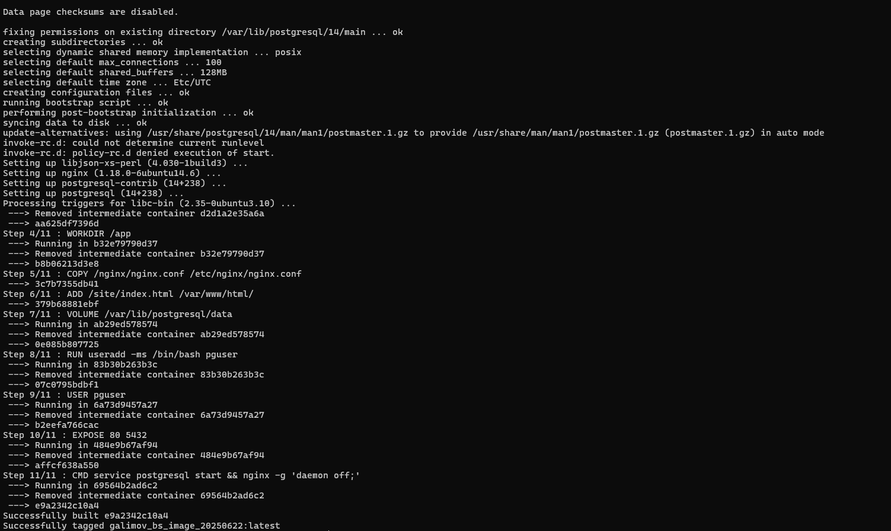

## Напишите Dockerfile для создания образа, который будет содержать веб-сервер Apache или Nginx и базу данных MySQL или postgresql

## Я выбрал Nginx и Postgres

---
## Описание
Вывод после успешной сборки

